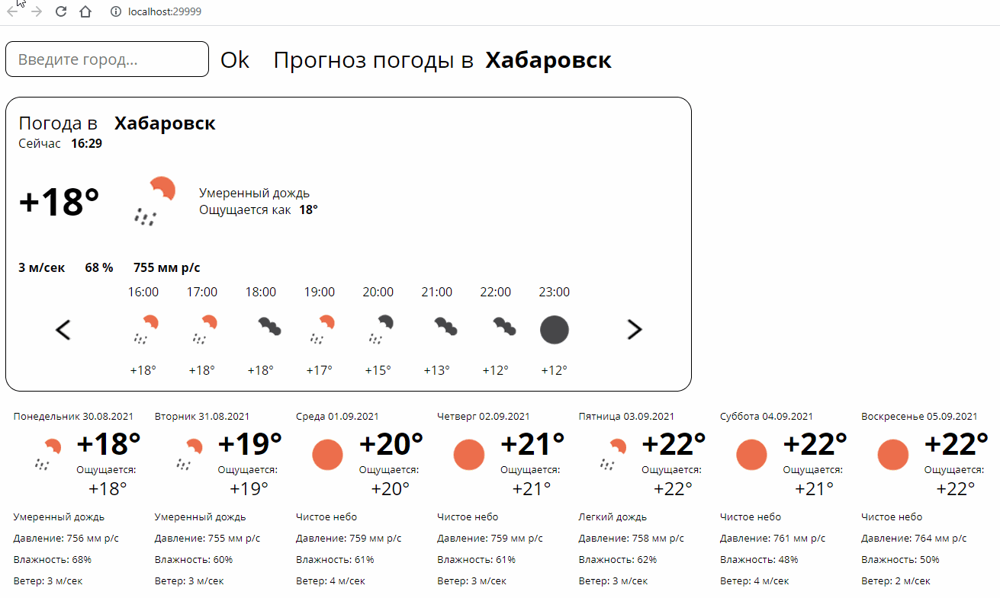

# Weather Forecaster

## What is it?
A small one-page application showing the weather for the specified city. It also shows the weather in hourly format for the next 48 hours

## How it works?
The project was created using:
- Spring MVC
- JSP + jstl + JS
- Maven
- openweather API
- dadata - geocode API

## What does it look like?
Here is a small demonstration of what is inside:

